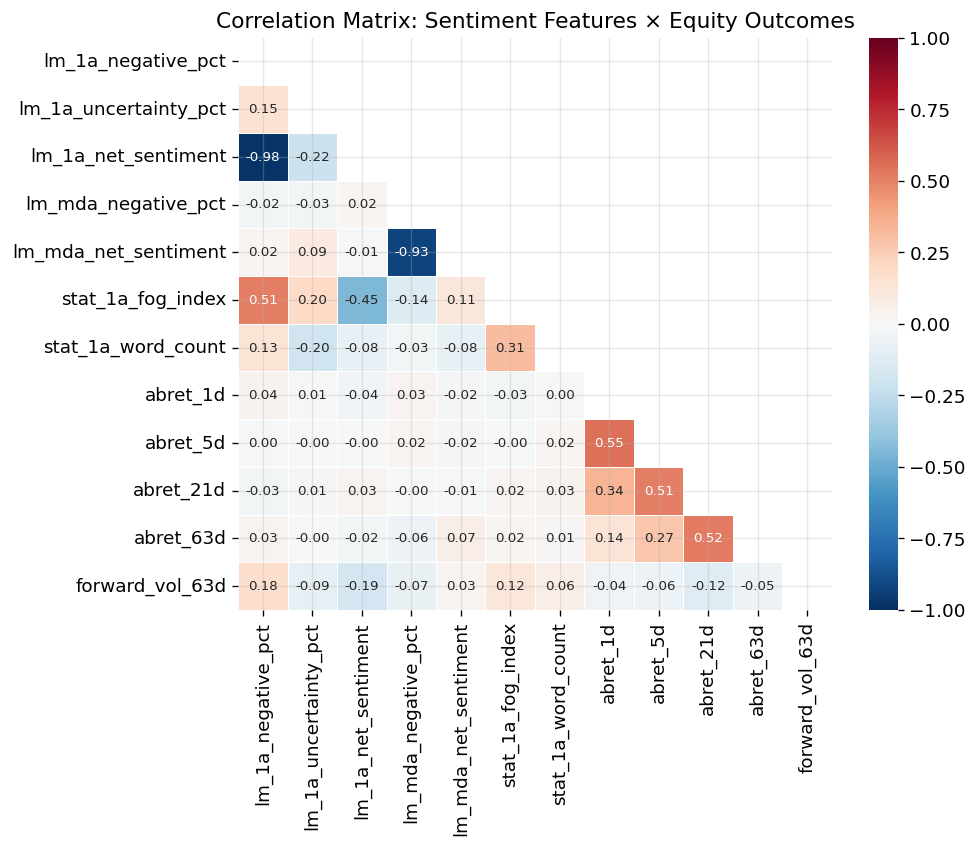
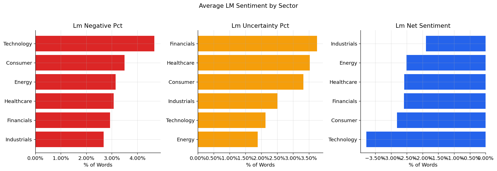
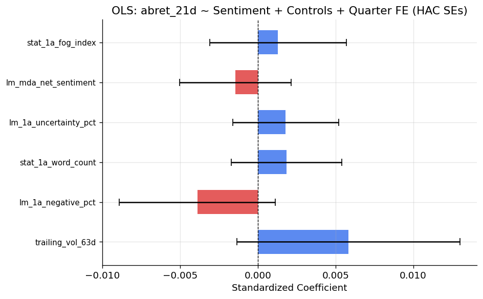
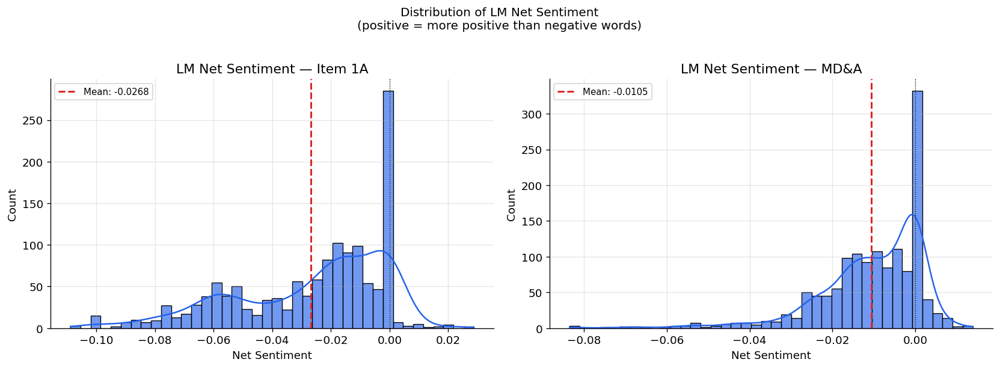
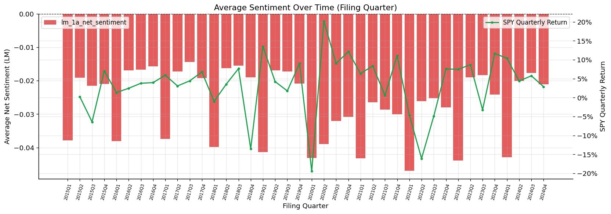

# 10k-nlp-sentiment-engine

> **An end-to-end NLP pipeline for SEC 10-K / 10-Q sentiment analysis
> linked to subsequent equity returns and volatility.**

---

## Overview

This project downloads SEC EDGAR annual (10-K) and quarterly (10-Q) filings
for 50 S&P 500 companies across six sectors (2015–2024), extracts structured
text sections (Item 1A Risk Factors, Item 7 MD&A), and measures language
features using two complementary methods:

1. **Loughran-McDonald (LM) domain dictionary** — finance-specific word lists
   for Negative, Positive, Uncertainty, Litigious, Constraining, and Modal
   word categories.

2. **FinBERT (ProsusAI/finbert)** — a BERT-based transformer fine-tuned on
   financial text, classifying sentences as positive / negative / neutral.

Computed features are linked to **subsequent equity returns** (abnormal
returns over 1-day, 5-day, 21-day, and 63-day windows, relative to SPY)
and **realized volatility** via:

- Quantile event studies with Newey-West t-tests.
- Pooled OLS regressions with HAC standard errors.
- Fama-MacBeth (1973) two-pass regressions.

## Architecture

```
SEC EDGAR API
     │
     ▼
edgar_downloader.py        ← Downloads raw HTML filings, respects rate limits
     │
     ▼
filing_parser.py           ← Extracts Item 1A and MD&A sections via regex
     │
     ▼
text_processor.py          ← Cleans text, tokenizes, computes Fog Index
     │
     ├──────────────────────────────────────────────┐
     ▼                                              ▼
sentiment_lm.py                         sentiment_finbert.py
(Loughran-McDonald dictionary)          (ProsusAI/finbert transformer)
     │                                              │
     └──────────────────┬───────────────────────────┘
                        ▼
                feature_builder.py     ← Merges text + equity features
                        │
                        ▼
        ┌───────────────┴──────────────────┐
        ▼                                  ▼
return_linker.py                    analytics.py
(Event studies, OLS, FM regressions) (Summary stats, plots, sector views)
        │                                  │
        └──────────────┬───────────────────┘
                       ▼
   notebooks/nlp_research_report.ipynb   app/streamlit_app.py
```

---

## Target Universe

50 S&P 500 companies across 6 sectors (filing period 2015–2024):

| Sector        | Tickers                                               |
|---------------|-------------------------------------------------------|
| Technology    | AAPL, MSFT, NVDA, GOOGL, META, AVGO, ORCL, CRM, INTC |
| Healthcare    | JNJ, UNH, LLY, ABBV, MRK, TMO, ABT, DHR              |
| Financials    | JPM, BAC, WFC, GS, MS, BLK, SCHW, AXP               |
| Consumer      | AMZN, TSLA, HD, MCD, NKE, PG, KO, WMT, COST          |
| Industrials   | CAT, HON, UPS, RTX, LMT, DE, GE, MMM                 |
| Energy        | XOM, CVX, COP, SLB, EOG, MPC, PSX, VLO               |

---

## Setup

### 1. Clone the repository

```bash
git clone https://github.com/your-username/10k-nlp-sentiment-engine.git
cd 10k-nlp-sentiment-engine
```

### 2. Create a virtual environment

```bash
python -m venv .venv
source .venv/bin/activate   # Windows: .venv\Scripts\activate
```

### 3. Install dependencies

```bash
pip install -r requirements.txt
```

### 4. Download the spaCy language model

```bash
python -m spacy download en_core_web_sm
```

### 5. Download the Loughran-McDonald dictionary

Visit [https://sraf.nd.edu/loughranmcdonald-master-dictionary/](https://sraf.nd.edu/loughranmcdonald-master-dictionary/)
and download the master dictionary CSV.  Place it at:

```
data/lm_dictionary/Loughran-McDonald_MasterDictionary.csv
```

Alternatively, the pipeline will attempt to download it automatically on
first run if an internet connection is available.

### 6. Set your SEC User-Agent

The SEC requires a descriptive `User-Agent` header for all EDGAR API requests.
Set the environment variable:

```bash
export SEC_USER_AGENT="Your Name your_email@example.com"
```

Or edit `config.py` directly:

```python
SEC_USER_AGENT = "Your Name your_email@example.com"
```

---

## Usage

### Step 1 — Download SEC filings

```python
from src.edgar_downloader import download_all_filings
manifest = download_all_filings()
print(manifest.head())
```

This will download all 10-K and 10-Q filings for the 50 tickers between
2015 and 2024, saving them to `data/filings/{TICKER}/{FILING_TYPE}/`.

**Expect this to take 1–3 hours** due to the SEC's 10-requests/second rate limit
and the volume of filings.

### Step 2 — Parse filings

```python
from src.filing_parser import parse_all_filings
filings_df = parse_all_filings()
print(filings_df[["ticker", "filing_type", "filing_date", "word_count"]].head(20))
```

### Step 3 — Build the feature panel

```python
from src.feature_builder import build_feature_panel_from_disk
panel = build_feature_panel_from_disk(
    run_finbert=True,           # Set to False to skip FinBERT (much faster)
    save_panel="data/feature_panel.parquet",
)
```

### Step 4 — Run analytics

```python
from src.analytics import sentiment_summary_stats, sector_breakdown, time_series_sentiment
from src.utils import fetch_equity_data

stats = sentiment_summary_stats(panel)
sector_df = sector_breakdown(panel)
prices = fetch_equity_data()
fig = time_series_sentiment(panel, prices)
fig.savefig("sentiment_ts.png")
```

### Step 5 — Event studies and regressions

```python
from src.return_linker import event_study, cross_sectional_regression, fama_macbeth_regression

# Event study: LM negativity → 21-day abnormal return
result = event_study(panel, "lm_1a_negative_pct", "abret_21d", n_quantiles=3)
print(result)

# OLS regression
ols = cross_sectional_regression(
    panel,
    y_column="abret_21d",
    x_columns=["lm_1a_negative_pct", "fb_1a_finbert_net_sentiment"],
    controls=["stat_1a_fog_index", "stat_1a_word_count"],
    add_quarter_fe=True,
)
print(ols.summary())

# Fama-MacBeth
fm_table = fama_macbeth_regression(
    panel, "abret_21d",
    ["lm_1a_negative_pct", "lm_1a_uncertainty_pct", "fb_1a_finbert_net_sentiment"],
)
print(fm_table)
```

### Step 6 — Jupyter notebook

## Figures

### 1. Correlation structure of sentiment and equity features


### 2. Sector-level LM sentiment exposure


### 3. OLS coefficients: return regression on sentiment + controls


### 4. Distribution of LM net sentiment (Item 1A vs. MD&A)


### 5. Average LM sentiment over time vs. SPY



---

## Module Reference

| Module                  | Purpose                                              |
|-------------------------|------------------------------------------------------|
| `config.py`             | All constants, paths, tickers, parameters            |
| `src/edgar_downloader`  | Download 10-K/10-Q filings from SEC EDGAR            |
| `src/filing_parser`     | Extract Item 1A (Risk) and Item 7 (MD&A) text        |
| `src/text_processor`    | Cleaning, tokenization, readability metrics          |
| `src/sentiment_lm`      | Loughran-McDonald dictionary scoring                 |
| `src/sentiment_finbert` | FinBERT sentence-level scoring with caching          |
| `src/feature_builder`   | Build master panel: text + equity features           |
| `src/return_linker`     | Event studies, OLS, Fama-MacBeth regressions         |
| `src/analytics`         | Descriptive statistics and visualization             |
| `src/utils`             | Equity data, return computation, I/O helpers         |

---

## Key Design Decisions

**No look-ahead bias**: Forward returns are computed starting from the
trading day *after* the SEC filing date — not the period-of-report date.

**SEC rate limits**: The downloader enforces ≤ 10 requests/second via
`time.sleep(0.11)` between requests.

**FinBERT caching**: All FinBERT inference results are pickled to
`data/finbert_cache/` so the notebook can be re-run without repeating
GPU-intensive inference.

**FinBERT token limit**: Each sentence is limited to 400 whitespace tokens.
Longer sentences are split at clause boundaries (commas / semicolons)
before being passed to the model.

---

## References

- Loughran, T., & McDonald, B. (2011). *When is a liability not a liability?
  Textual analysis, dictionaries, and 10-Ks.* Journal of Finance, 66(1), 35–65.
  [https://doi.org/10.1111/j.1540-6261.2010.01625.x](https://doi.org/10.1111/j.1540-6261.2010.01625.x)

- Huang, A., Wang, H., & Yang, Y. (2023). *FinBERT: A large language model
  for extracting information from financial text.* Contemporary Accounting
  Research, 40(2), 806–841.
  [https://doi.org/10.1111/1911-3846.12832](https://doi.org/10.1111/1911-3846.12832)

- Araci, D. (2019). *FinBERT: Financial Sentiment Analysis with Pre-trained
  Language Models.* arXiv:1908.10063.
  [https://arxiv.org/abs/1908.10063](https://arxiv.org/abs/1908.10063)

- Fama, E. F., & MacBeth, J. D. (1973). *Risk, return, and equilibrium:
  Empirical tests.* Journal of Political Economy, 81(3), 607–636.

- Newey, W. K., & West, K. D. (1987). *A simple, positive semi-definite,
  heteroskedasticity and autocorrelation consistent covariance matrix.*
  Econometrica, 55(3), 703–708.

---

## Disclaimer

> **For research and educational purposes only.**
> This software does not constitute investment advice.  Past sentiment-return
> relationships do not guarantee future results.  Always consult a qualified
> financial advisor before making investment decisions.

---

## License

MIT License

Copyright (c) 2024

Permission is hereby granted, free of charge, to any person obtaining a copy
of this software and associated documentation files (the "Software"), to deal
in the Software without restriction, including without limitation the rights
to use, copy, modify, merge, publish, distribute, sublicense, and/or sell
copies of the Software, and to permit persons to whom the Software is
furnished to do so, subject to the following conditions:

The above copyright notice and this permission notice shall be included in all
copies or substantial portions of the Software.

THE SOFTWARE IS PROVIDED "AS IS", WITHOUT WARRANTY OF ANY KIND, EXPRESS OR
IMPLIED, INCLUDING BUT NOT LIMITED TO THE WARRANTIES OF MERCHANTABILITY,
FITNESS FOR A PARTICULAR PURPOSE AND NONINFRINGEMENT. IN NO EVENT SHALL THE
AUTHORS OR COPYRIGHT HOLDERS BE LIABLE FOR ANY CLAIM, DAMAGES OR OTHER
LIABILITY, WHETHER IN AN ACTION OF CONTRACT, TORT OR OTHERWISE, ARISING FROM,
OUT OF OR IN CONNECTION WITH THE SOFTWARE OR THE USE OR OTHER DEALINGS IN THE
SOFTWARE.
